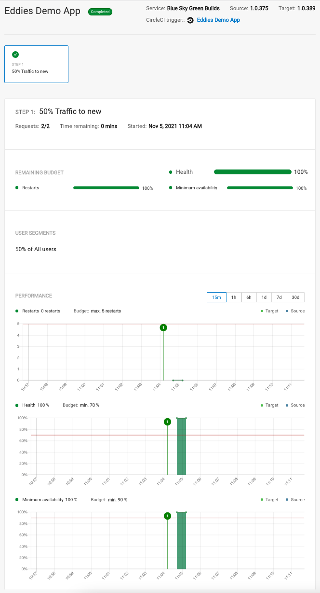

# Circle CI Demo

Build, Test and Deploy a modern webapp using CircleCI. 

Technologies covered:
- Build a Spring Boot app with Maven (and caching maven repos!)
- Tests generated by [Ponicode](https://www.ponicode.com/)
- Packaged as docker image (without daemon!) using Google Jib
- Browser testing with Selenium and Saucelabs (disabled account :( )
- Static Code Analysis with SonarQube (disabled account :( )
- Manual Approval/Promotion
- Canary deployment to Kubernetes cluster using Vamp.io Release Orchestration policies.

[](https://circleci.com/gh/eddiewebb/demo-blueskygreenbuilds)
[](https://codeclimate.com/github/eddiewebb/demo-blueskygreenbuilds/maintainability)
[](https://codeclimate.com/github/eddiewebb/demo-blueskygreenbuilds/test_coverage)

##  Testing
To test simple UI functionality we're using Spring Boot's test starter and SauceLabs Connect Tunnel binaries driven through Selenium's `WebDriver` interface.  The use of SauceLabs let's us run several browser combinations in parallel.

You can see these simple tests in [HomePagesTests.java](src/test/java/com/edwardawebb/circleci/demo/it/HomePageIT.java)

## Release Orchestration example 
We can use a PaaS/FaaS cluster and canary or blue/green releases for **zero-downtime** deployments using [Blue/Green strategy](https://martinfowler.com/bliki/BlueGreenDeployment.html).

1. deploy new version of service as container image (i.e. in dockerhub, ecr, etc)
1. Rollout new image to XX% of traffice, or by cohort
1. Monitor key metrics like heatlh and activity to determine validity of new version
1. Automatically fail or proceed rollout.


### Viewing
And live app visible on http://blueskygreenbuilds.com

### Interesting Things

- We're using a service account in CircleCI to apply the deployment
- Traffic is shaped via contour as influence by Vamp policies
- We grab a [visual of the routes from contour](https://app.circleci.com/pipelines/github/eddiewebb/demo-blueskygreenbuilds/389/workflows/b164a140-8b2b-4ade-9f44-2a9814d3c017/jobs/2513/artifacts_) and save  as artifact in build 
- Spring Boot app is exposing a [metrics API](http://blueskygreenbuilds.com/actuator/metrics/visit_counter) that prometheus scrape, which can drive custom policy metrics. 



## Running locally

This project uses spring boot, so run as you would any other like project to start on port :8080 locally.

```
mvn spring-boot:run
```


# Demo
See [demo-assets](demo-assets)
